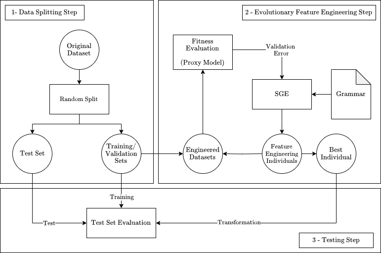

# Walkthrough

In this chapter, we will explore how to customize the Fedora Framework to perfectly fit your data science and machine learning projects. Whether you are working on unique data types or advanced techniques, this chapter will guide you in maximizing the potential of the Fedora Framework for your specific needs.

We will use the [Car Evaluation Dataset](https://archive.ics.uci.edu/dataset/19/car+evaluation) in this walkthrough.

## Original dataset

First, we will need to download the dataset. The UCI Machine Learning repository python package allows us to do such with ease. To install it, run:

```bash
pip3 install ucimlrepo
```

Create a _main.py_ file and load the data:

```python
from ucimlrepo import fetch_ucirepo 
dataset = fetch_ucirepo(id=19) 
```

Create a pandas dataframe and load the data:

```python
import pandas as pd
features = dataset.data.features
targets = dataset.data.targets["class"]
df = pd.concat([targets, features], axis=1)
```

At this point, the resulting dataset is the following:

```python
print(df)
```

```TEXT
      class buying  maint  doors persons lug_boot safety
0     unacc  vhigh  vhigh      2       2    small    low
1     unacc  vhigh  vhigh      2       2    small    med
2     unacc  vhigh  vhigh      2       2    small   high
3     unacc  vhigh  vhigh      2       2      med    low
4     unacc  vhigh  vhigh      2       2      med    med
...     ...    ...    ...    ...     ...      ...    ...
1723   good    low    low  5more    more      med    med
1724  vgood    low    low  5more    more      med   high
1725  unacc    low    low  5more    more      big    low
1726   good    low    low  5more    more      big    med
1727  vgood    low    low  5more    more      big   high

[1728 rows x 7 columns]
```

Regarding the metadata of the dataset:

```python
mt = dataset.metadata
print(f"Features: {mt.num_features}")
print(f"Types: {mt.feature_types}")
print(f"Entries: {mt.num_instances}")
print(f"Missing Values: {mt.has_missing_values}")

print(f"Summary:\n\n {mt.additional_info.summary}")
print(f"Info:\n\n {mt.additional_info.variable_info}")

print(df["class"].value_counts())
```

```TEXT
Features: 6
Types: ['Categorical']
Entries: 1728
Missing Values: no

Summary: 

Car Evaluation Database was derived from a simple hierarchical decision model originally developed for the demonstration of DEX, M. Bohanec, V. Rajkovic: Expert system for decision making. Sistemica 1(1), pp. 145-157, 1990.). The model evaluates cars according to the following concept structure:

CAR                      car acceptability
. PRICE                  overall price
. . buying               buying price
. . maint                price of the maintenance
. TECH                   technical characteristics
. . COMFORT              comfort
. . . doors              number of doors
. . . persons            capacity in terms of persons to carry
. . . lug_boot           the size of luggage boot
. . safety               estimated safety of the car

Input attributes are printed in lowercase. Besides the target concept (CAR), the model includes three intermediate concepts: PRICE, TECH, COMFORT. Every concept is in the original model related to its lower level descendants by a set of examples (for these examples sets see http://www-ai.ijs.si/BlazZupan/car.html).

The Car Evaluation Database contains examples with the structural information removed, i.e., directly relates CAR to the six input attributes: buying, maint, doors, persons, lug_boot, safety.

Because of known underlying concept structure, this database may be particularly useful for testing constructive induction and structure discovery methods.

Info:

buying:   vhigh, high, med, low.
maint:    vhigh, high, med, low.
doors:    2, 3, 4, 5more.
persons:  2, 4, more.
lug_boot: small, med, big.
safety:   low, med, high.

class
unacc    1210
acc       384
good       69
vgood      65
Name: count, dtype: int64
```

We can conclude that:

* There are 4 highly unbalanced classes: "unacc", "acc", "good" and "vgood".
* All 6 features are categorical. Therefore, they might require further preprocessing.
* There are no missing values on the 1728 available entries. If there were, one should proceed to fix or delete such entries.

## Representation and Operators

In this step, one must figure out how to represent the problem and which operators should use.

An operator can be virtually anything that combines or simply transforms features:

* Integers and Floats: sum(a,b), subtraction(a,b), division(a,b), multiplication(a,b), absoluteValue(a,b), maximum(a,b), noise(a)
* Boolean: AND(a,b), OR(a,b), NOT(a)
* Strings: length(a)

For an operator to be compatible with the framework, it must:

* Mandatory: Return a numeric type (boolean, integer, float)
* Mandatory: Handle pandas.Series as arguments
* Optional: Avoid the return of NaN values, as they will be replaced with 1
* Optional: Ensure returned values conform to a 32-bit floating-point range, since outside it will be set to np.float32's negative or positive extremes

Having the definition of an operator established, the following question is fundamental:

```Text
Am I able to think of operators that have the ability to combine the current features in a way that the resulting feature makes sense?
```

If the answer is yes, then jump into the [next section](walkthrough.md#defining-the-features).

If not, then we will have to think about how can we represent these features in a way that the result of the operator is interpretable:

**Related example** Let's say that the entries _A_, _B_ and _C_ have the following feature values:

```TEXT
Entry    buying    maint    ...
A        "vhigh"   "med"    ...
B        "high"    "med"    ...
C        "vhigh"   "low"    ...
```

If I select an operator "MyOpt" that counts the "i" in the strings, for the features "buying" and "maint", the transformed dataset might become:

```TEXT
Entry    buying    maint    MyOpt(buying)  MyOpt(maint)    ...
A        "vhigh"   "med"    1              0               ...
B        "high"    "med"    1              0               ...
C        "vhigh"   "low"    1              0               ...
```

The resulting features are rather meaningless or at least not easily interpretable for the problem at hand.

However if one changes the dataset representation by one-hot encoding the features (will only display the buying-vhigh and maint-med codes for simplicity) and then selecting the logical AND operator to merge them:

```TEXT
Entry    buying-vhigh    ...    maint-med   ...    buying-vhigh AND maint-med    ...
A        True            ...    True        ...    True                          ...
B        False           ...    True        ...    False                         ...
C        True            ...    False       ...    False                         ...
```

The resulting feature "buying-vhigh AND maint-med" literally means:

```TEXT
Is the buying price of the car very high and the price of maintenance average (medium)?
```

As such, this feature and all features alike have the potential of being much more informative, and we might even end up with fewer but better features.

Hence, for the dataset at hand, we could one-hot encode all 6 features and then apply boolean operators (AND, OR, NOT) between them.

One-hot encoding the features leaves us with the following dataset:

```python
# One-hot Encoding Features
oe_features = pd.get_dummies(features)

# Label encoding for numerical compatibility with ML models
labels, names = pd.factorize(targets)

df = pd.concat([pd.Series(labels, name="class"), oe_features], axis=1)
print(df)
```

```TEXT
      class  buying_high  buying_low  buying_med  buying_vhigh  maint_high  maint_low  ...  persons_more  lug_boot_big  lug_boot_med  lug_boot_small  safety_high  safety_low  safety_med
0         2        False       False       False          True       False      False  ...         False         False         False            True        False        True       False
1         2        False       False       False          True       False      False  ...         False         False         False            True        False       False        True
2         2        False       False       False          True       False      False  ...         False         False         False            True         True       False       False
3         2        False       False       False          True       False      False  ...         False         False          True           False        False        True       False
4         2        False       False       False          True       False      False  ...         False         False          True           False        False       False        True
...     ...          ...         ...         ...           ...         ...        ...  ...           ...           ...           ...             ...          ...         ...         ...
1723      1        False        True       False         False       False       True  ...          True         False          True           False        False       False        True
1724      3        False        True       False         False       False       True  ...          True         False          True           False         True       False       False
1725      2        False        True       False         False       False       True  ...          True          True         False           False        False        True       False
1726      1        False        True       False         False       False       True  ...          True          True         False           False        False       False        True
1727      3        False        True       False         False       False       True  ...          True          True         False           False         True       False       False

[1728 rows x 22 columns]
```

We were left with an encoded label and 21 boolean features.

To create your own custom operators, please check [this section](details.md#building-a-custom-operator).

## Defining the features

After choosing the logical operators (AND, OR, and NOT) and preparing the initial dataset, the next step is to establish the construction rules for the new features. This task can be accomplished by specifying a Context-Free Grammar (CFG) that will be used as input for the framework.

To begin, determine the maximum number of features for the transformed dataset. To ensure an unbiased process, set this number equal to the count of features in the prepared dataset, which is 21. Subsequently, generate the grammar as follows:

```python
from fedora.utilities.lib import generate_grammar

parameters = {
    "max_features": 21,
    "operators1": ["~"],                  # Arity = 1: NOT (~)
    "operators2": ["&", "\eb"],           # Arity = 2: AND (&), OR (| -> \eb)
    "columns": oe_features.columns
}

with open("car-evaluation.pybnf", "w") as f:
    grammar = generate_grammar(**parameters)
    print(grammar, file=f)
```

This straightforward function serves as an initial setup for your grammar, and you're encouraged to make manual adjustments as needed. The grammar, presented in Backus-Naur Form (BNF), is provided below:

```bnf
# car-evaluation.pybnf
<start> ::= <feature>,|<feature>,<feature>|<feature>,<feature>,<feature>|<feature>,<feature>,<feature>,<feature>|<feature>,<feature>,<feature>,<feature>,<feature>|<feature>,<feature>,<feature>,<feature>,<feature>,<feature>|<feature>,<feature>,<feature>,<feature>,<feature>,<feature>,<feature>|<feature>,<feature>,<feature>,<feature>,<feature>,<feature>,<feature>,<feature>|<feature>,<feature>,<feature>,<feature>,<feature>,<feature>,<feature>,<feature>,<feature>|<feature>,<feature>,<feature>,<feature>,<feature>,<feature>,<feature>,<feature>,<feature>,<feature>|<feature>,<feature>,<feature>,<feature>,<feature>,<feature>,<feature>,<feature>,<feature>,<feature>,<feature>|<feature>,<feature>,<feature>,<feature>,<feature>,<feature>,<feature>,<feature>,<feature>,<feature>,<feature>,<feature>|<feature>,<feature>,<feature>,<feature>,<feature>,<feature>,<feature>,<feature>,<feature>,<feature>,<feature>,<feature>,<feature>|<feature>,<feature>,<feature>,<feature>,<feature>,<feature>,<feature>,<feature>,<feature>,<feature>,<feature>,<feature>,<feature>,<feature>|<feature>,<feature>,<feature>,<feature>,<feature>,<feature>,<feature>,<feature>,<feature>,<feature>,<feature>,<feature>,<feature>,<feature>,<feature>|<feature>,<feature>,<feature>,<feature>,<feature>,<feature>,<feature>,<feature>,<feature>,<feature>,<feature>,<feature>,<feature>,<feature>,<feature>,<feature>|<feature>,<feature>,<feature>,<feature>,<feature>,<feature>,<feature>,<feature>,<feature>,<feature>,<feature>,<feature>,<feature>,<feature>,<feature>,<feature>,<feature>|<feature>,<feature>,<feature>,<feature>,<feature>,<feature>,<feature>,<feature>,<feature>,<feature>,<feature>,<feature>,<feature>,<feature>,<feature>,<feature>,<feature>,<feature>|<feature>,<feature>,<feature>,<feature>,<feature>,<feature>,<feature>,<feature>,<feature>,<feature>,<feature>,<feature>,<feature>,<feature>,<feature>,<feature>,<feature>,<feature>,<feature>|<feature>,<feature>,<feature>,<feature>,<feature>,<feature>,<feature>,<feature>,<feature>,<feature>,<feature>,<feature>,<feature>,<feature>,<feature>,<feature>,<feature>,<feature>,<feature>,<feature>|<feature>,<feature>,<feature>,<feature>,<feature>,<feature>,<feature>,<feature>,<feature>,<feature>,<feature>,<feature>,<feature>,<feature>,<feature>,<feature>,<feature>,<feature>,<feature>,<feature>,<feature>
<feature> ::= <feature><op2><feature> | (<feature><op2><feature>) | x[<var>] | <op1>x[<var>]
<op1> ::= ~
<op2> ::= &|\eb
<var> ::= 'buying_high'|'buying_low'|'buying_med'|'buying_vhigh'|'maint_high'|'maint_low'|'maint_med'|'maint_vhigh'|'doors_2'|'doors_3'|'doors_4'|'doors_5more'|'persons_2'|'persons_4'|'persons_more'|'lug_boot_big'|'lug_boot_med'|'lug_boot_small'|'safety_high'|'safety_low'|'safety_med'
```

**Note:** If you wish to utilize certain reserved symbols in the grammar, kindly include their aliases within the grammar instead:

| Symbol | Alias |
| :----: | :---: |
|   <=   |  \le  |
|   >=   |  \ge  |
|    <   |   \l  |
|    >   |   \g  |
|   \|   |  \eb  |
|    ,   |  None |

The comma is restricted by the framework for distinguishing features within the phenotype string, and its usage is prohibited in the grammar.

## Tunning the Evolution Process

The Fedora Framework uses [Structured Grammatical Evolution (SGE)](https://github.com/nunolourenco/sge3) as the evolutionary algorithm. The Figure below shows the topology of the framework:



In line with typical evolutionary algorithms, SGE requires specific parameters such as population size, generations, etc. These parameters are to be specified in a Yaml file as outlined below:

```yaml
# car-evaluation.yml
POPSIZE: 2000                                   # Population Size
GENERATIONS: 100                                # Generations
ELITISM: 200                                    # Elistism (10%)
PROB_CROSSOVER: 0.9                             # Crossover: Probability
PROB_MUTATION: 0.1                              # Mutation: Probability
TSIZE: 3                                        # Selection: Tournament Size
EXPERIMENT_NAME: 'car-evaluation-results/'      # Results folder name
INCLUDE_GENOTYPE: False                         # Option include the genotype in the logs
SAVE_STEP: 200                                  # Logging Frequency (every N generations)
VERBOSE: True                                   # Statistics of each generation when running the algorithm 
MIN_TREE_DEPTH: 3                               # Genetic Programming Tree Minimum Depth
MAX_TREE_DEPTH: 10                              # Genetic Programming Tree Maximum Depth
```

**Note:** There are more parameters available for SGE (grammar, seed, run) that we will define indirectly, for simplicity. The parameters mentioned above are the only ones that must be included in the Yaml file.

## Running the Framework

First, let's start by splitting the data:

```python
from fedora.core.utilities.lib import split_data
SEED = 42
train_val, test = split_data(oe_features, labels, SEED, test_size=0.2)
```

This returns two dictionaries (train\_val (80%) and test (20%)) with keys **X** and **y** for the features and labels, respectively.

Finally, to assess the fitness of SGE, one only requires a machine learning model and an error metric (as SGE aims to minimize the objective function). There is also required a seed for initializing the random number generators of the machine learning model, SGE and dataset partitioning (training and validation).

```python
from fedora.core.engine import Fedora

from sklearn.metrics import balanced_accuracy_score
from sklearn.tree import DecisionTreeClassifier

def errorBAcc(true, pred):
    return 1 - balanced_accuracy_score(true, pred)

# SEED = 42

fedora = Fedora(
    seed = SEED,                                    
    model = DecisionTreeClassifier(),
    error_metric = errorBAcc,
    sge_parameters_path = "car-evaluation.yml",
    grammar_path = "car-evaluation.pybnf",
    logging_dir = "./"
)
```

In this context, we have selected:

* To run the algorithm with the seed 42
* A Decision Tree Classifier as the machine learning model, due to its interpretability
* Balanced Accuracy as the performance metric (The error is just **1 - BAcc**), since the classes are unbalanced.

To run the framework simply do:

```python
fedora.fit(**train_val)       # fedora.fit(train_val['X'], train_val['y']) 
```

**Note:** The X parameter is inherently designed to be a pandas.DataFrame without any deviation.

From this point, the algorithm will randomly split the **train\_val** dataset into 2 subsets: **train** (50%) and **validation** (50%), using them in the feature engineering process. The train set will fit the machine learning model while the validation set will assess its generalization capabilities.

Once ended, the results are logged, generating the following generic folder structure:

```
car-evaluation-results        # Results folder name
├── run_0                     # run_{seed} 
│   └── ...                   
└── run_42                    # run_{seed} 
    ├── best.json             # Phenotype with best validation score
    ├── iteration_0.json      # Log of the 1st generation
    ├── iteration_1.json      # Log of the 2st generation
    ├── ...                   # ...
    ├── parameters.json       # Structured Grammatical Evolution Parameters
    ├── progress_report.csv   # Fitness statistics of each generation 
    └── warnings.txt          # Logged runtime warnings (if any)
```

If results have been logged for a particular seed, running the framework with that exact seed will bypass the evolutionary process, fetching the best phenotype directly from memory.

Applying the best individual to the train\_val and test sets:

```PYTHON
train_val_fedora = fedora.transform(**train_val)
test_fedora = fedora.transform(**test)
print(train_val_fedora)
```

```
      feature_0  feature_1  feature_2  feature_3  feature_4   ...  feature_13  feature_14  feature_15  feature_16  feature_17  feature_18  feature_19  feature_20
0           1.0        0.0        1.0        1.0        1.0   ...         0.0         1.0         1.0         0.0         0.0         1.0         0.0         0.0
1           0.0        0.0        1.0        1.0        0.0   ...         1.0         1.0         1.0         1.0         1.0         1.0         1.0         1.0
2           1.0        0.0        1.0        1.0        1.0   ...         0.0         1.0         0.0         1.0         0.0         0.0         0.0         0.0
3           0.0        1.0        1.0        1.0        0.0   ...         0.0         1.0         1.0         1.0         0.0         0.0         1.0         0.0
4           1.0        1.0        0.0        1.0        0.0   ...         0.0         1.0         1.0         1.0         0.0         0.0         0.0         0.0
...         ...        ...        ...        ...        ...   ...         ...         ...         ...         ...         ...         ...         ...         ...
1377        1.0        0.0        1.0        1.0        0.0   ...         0.0         1.0         1.0         1.0         0.0         0.0         0.0         0.0
1378        0.0        0.0        1.0        1.0        1.0   ...         0.0         1.0         0.0         1.0         0.0         0.0         1.0         0.0
1379        1.0        1.0        1.0        1.0        0.0   ...         0.0         1.0         0.0         1.0         0.0         0.0         0.0         0.0
1380        0.0        0.0        1.0        1.0        0.0   ...         1.0         0.0         1.0         1.0         1.0         0.0         1.0         0.0
1381        0.0        0.0        1.0        1.0        0.0   ...         1.0         1.0         1.0         1.0         1.0         0.0         1.0         0.0

[1382 rows x 21 columns]
```

## Results

To assess the results acquired against the baseline, we can simply do the entire procedure with two [scikit-learn pipelines](https://scikit-learn.org/stable/modules/generated/sklearn.pipeline.Pipeline.html):

```python
from sklearn.pipeline import Pipeline
from sklearn.preprocessing import OneHotEncoder

# fedora = Fedora(...)
oe = OneHotEncoder(dtype=bool, sparse_output=False).set_output(transform="pandas") # Same as pandas.get_dummies()
dt = DecisionTreeClassifier(random_state=SEED)

# Pipelines
pipeline_baseline = Pipeline([
    ("encoder", oe),
    ("classifier", dt)
])

pipeline_fedora = Pipeline([
    ("encoder", oe),
    ("feature-engineering", fedora),
    ("classifier", dt)
])
```

Now just fit them with the train\_val set and report their test set scores:

```python
from sklearn.metrics import classification_report

train_val, test = split_data(features, labels, SEED, test_size=0.2)

baseline_pred = pipeline_baseline.fit(**train_val).predict(test['X'])
fedora_pred = pipeline_fedora.fit(**train_val).predict(test['X'])

for predictions in [baseline_pred, fedora_pred]:
    print(classification_report(test['y'], predictions, target_names=names, digits=4))
```

```
# Baseline Pipeline Test Set Report
              precision    recall  f1-score   support

       unacc     0.9792    1.0000    0.9895       235
         acc     0.9863    0.8675    0.9231        83
       vgood     0.8235    0.8235    0.8235        17
        good     0.6250    0.9091    0.7407        11

    accuracy                         0.9566       346
   macro avg     0.8535    0.9000    0.8692       346
weighted avg     0.9620    0.9566    0.9575       346

```

```
# Fedora Pipeline Test Set Report
              precision    recall  f1-score   support

       unacc     0.9832    0.9957    0.9894       235
         acc     0.9730    0.8675    0.9172        83
       vgood     1.0000    1.0000    1.0000        17
        good     0.5882    0.9091    0.7143        11

    accuracy                         0.9624       346
   macro avg     0.8861    0.9431    0.9052       346
weighted avg     0.9690    0.9624    0.9639       346

```

Fedora was able to:

* &#x20;Improve the **Accuracy** metric! (95.66% vs 96.24%)&#x20;
* Improve the **Balanced Accuracy** (Recall Macro Average) metric! (90% vs 94.31%)

Therefore, we have shown the potential for effectiveness and hassle-free style of the framework for feature engineering tasks!

A summarized version of the entire procedure can be located [here](https://github.com/miguelrabuge/fedora/tree/main/examples/car-evaluation/main.py).
